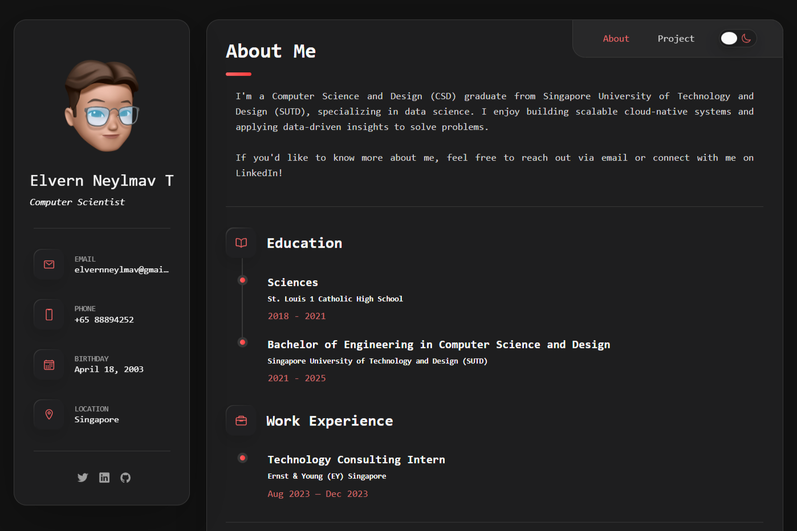
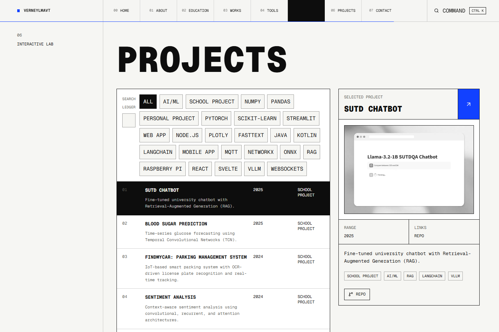

# verneylmavt.vercel.app (v1)

Legacy / first iteration of my personal website.

This branch is a **static site** (plain HTML/CSS/JS) with a sidebar layout, a light/dark theme toggle, filterable projects, and a project-details modal.

## Screenshots





## Run locally

No build step is required.

- Quick: open `index.html` directly in your browser
- Recommended: serve the folder with a static file server

Examples:

```bash
# Node
npx serve .

# Python
python -m http.server 8000
```

Then open `http://localhost:8000`.

## Customize

- Content + structure: `index.html`
- Styles: `static/css/style.css`
- Interactions (theme toggle, filtering, modals, navigation): `static/js/script.js`
- Images/icons: `assets/**`

## Deploy

Deploy as a static site (Vercel / Netlify / GitHub Pages). The entry point is `index.html` in the repository root.
