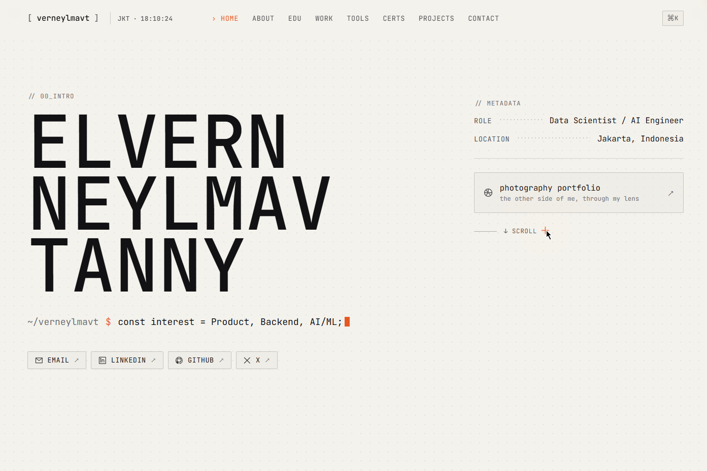
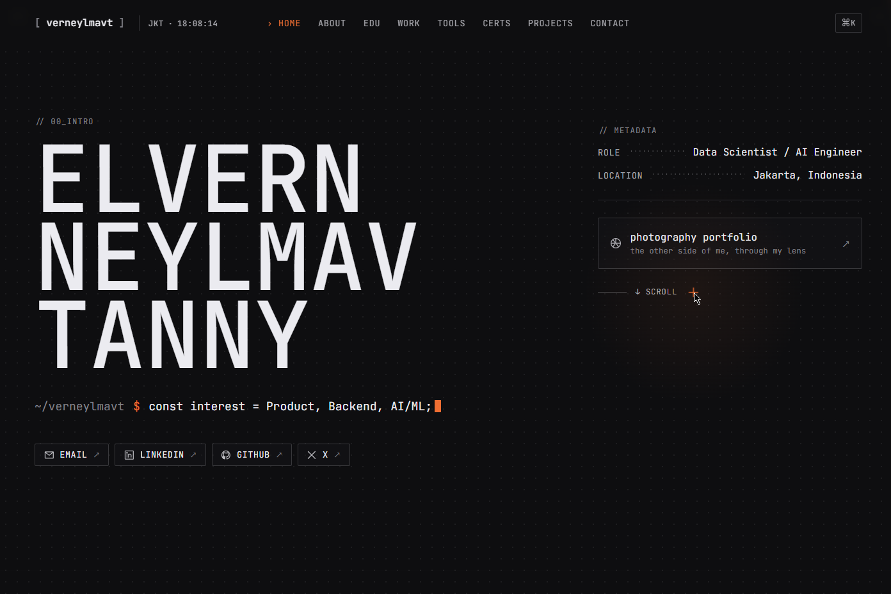
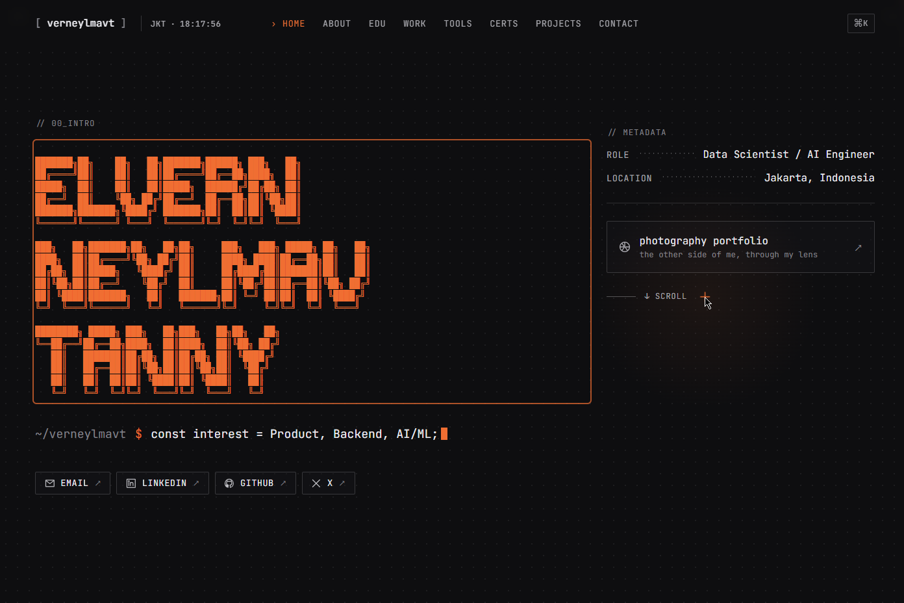
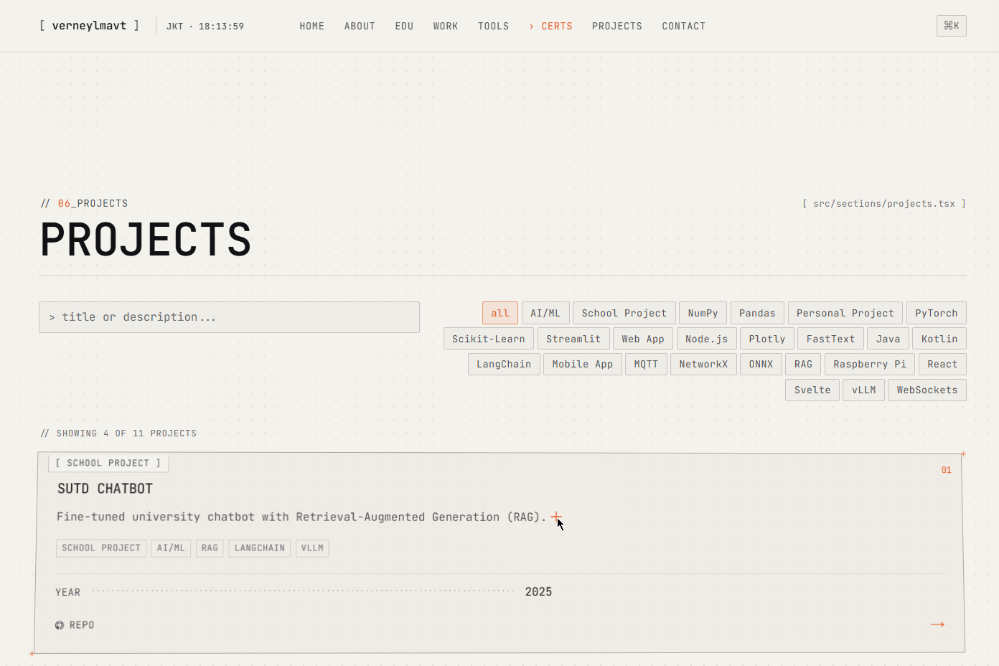
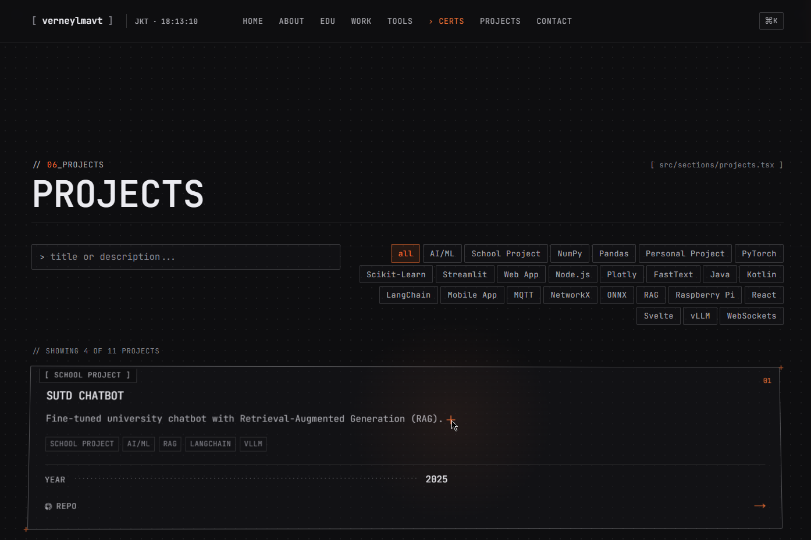

# verneylmavt.vercel.app (v3)

This project is the third iteration of my personal website, refining the content-centric architecture introduced in v2. All portfolio data—such as projects, experience, certifications, and contacts—is defined in structured models and rendered dynamically through reusable React components. This allows for easier maintenance, clear separation of data and presentation, and scalable updates as the portfolio grows.

From an engineering and design perspective, this version emphasizes immersive interactivity and visual polish. It integrates a Swiss/monospace aesthetic, terminal-inspired UI, smooth transitions with Framer Motion, mini-terminal commands, ASCII art hero, command palette, theme switching, and advanced visual effects including scanlines and Matrix rain. These features blend readable typography, responsive layouts, and subtle animations to create a professional yet playful personal brand experience.

## Tech Stack

- Next.js (App Router)
- TypeScript
- Tailwind CSS
- Framer Motion
- React
- cmdk (Command Palette)
- Lucide-react (Icons)
- Tailwind Merge & clsx (Utility Classes)
- WebGL / Canvas (Matrix Rain & Easter Eggs)

## Galleries











## Run

### Requirements

- Git
- Browser
- Node.js >= 20.9.0
- npm

### Clone

```bash
git clone https://github.com/verneylmavt/verneylmavt.vercel.app.git
git cd verneylmavt.vercel.app
git checkout v3
```

### Install

```bash
npm install
```

### Local Run

```bash
npm run dev
```

Open: `http://localhost:3000`.

## Customize

- Content: `src/content/site.ts`
- Metadata + Fonts: `src/app/layout.tsx`
- Design + Palette: `src/app/globals.css`
- Sections + Animations + Filters: `src/components/site/SitePage.tsx`
- Icons: `src/components/ui/glyphs.tsx`
- Mini Terminal: `src/components/site/Hero.tsx`
- Theme System: `src/components/ThemeProvider.tsx`
- Visual Effects: `src/components/visual/`

## Project Structure

```text
src/
  app/         # Next.js routes, layout, global styles
  components/  # UI + visual + interactive components
  content/     # Site content model + data
  lib/         # Utilities (formatting, classNames, etc.)
public/
  projects/    # Project thumbnails
  badges/      # Certification badges
  demo_*       # Screenshot galleries for README
```
