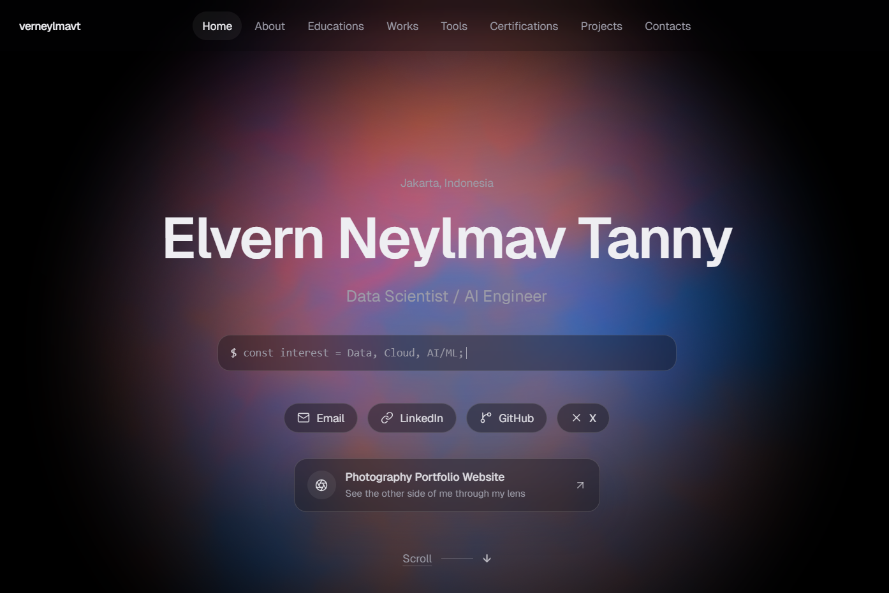
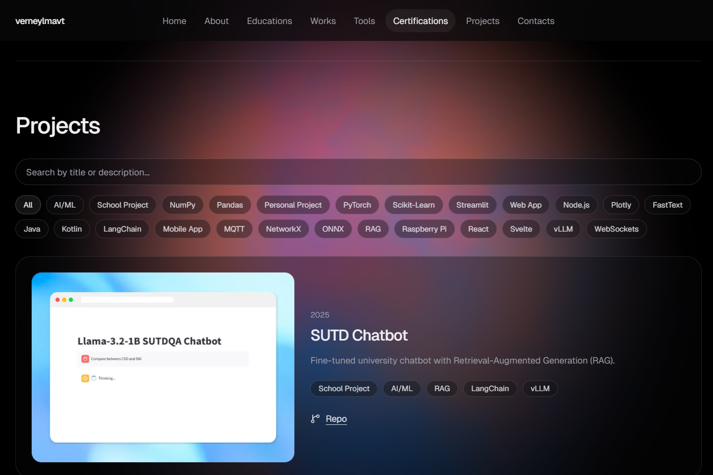

# verneylmavt.vercel.app (v2)

Current iteration of my personal website.

Built with **Next.js (App Router)**, **Tailwind CSS v4**, and **Framer Motion**, with an optional **WebGL fluid background** (Three.js / React Three Fiber + low-end GPU detection + respects `prefers-reduced-motion`).

## Screenshots





## Getting started

### Requirements

- Node.js **>= 20.9.0** (required by `next`)
- npm (this repo includes `package-lock.json`)

### Install

```bash
npm ci
```

### Run locally

```bash
npm run dev
```

Open `http://localhost:3000`.

### Build / start

```bash
npm run build
npm run start
```

### Lint

```bash
npm run lint
```

## Customize

- Content (data-driven): `src/content/site.ts`
- Metadata + fonts: `src/app/layout.tsx`
- Design tokens + palette: `src/app/globals.css`
- Sections, animations, project filtering: `src/components/site/SitePage.tsx`
- Icons mapping: `src/components/icon.tsx`
- WebGL background: `src/components/visual/FluidBackground.tsx`
  - Disable by removing `<FluidBackground />` from `src/components/site/SitePage.tsx`

## Project structure

```text
src/
  app/         # Next.js routes, layout, global styles
  components/  # UI + visual components
  content/     # Site content model + data
  lib/         # Small utilities
public/
  projects/    # Project thumbnails
  badges/      # Certification badge images
```

## Notes

- No runtime env vars are required for the default build.
- `VERCEL.md` contains the default Next.js (create-next-app) notes.
- No `LICENSE` file is included in this branch.
